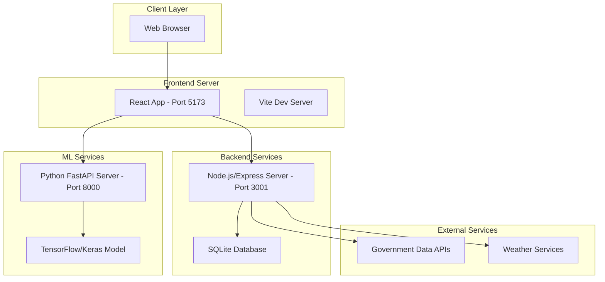
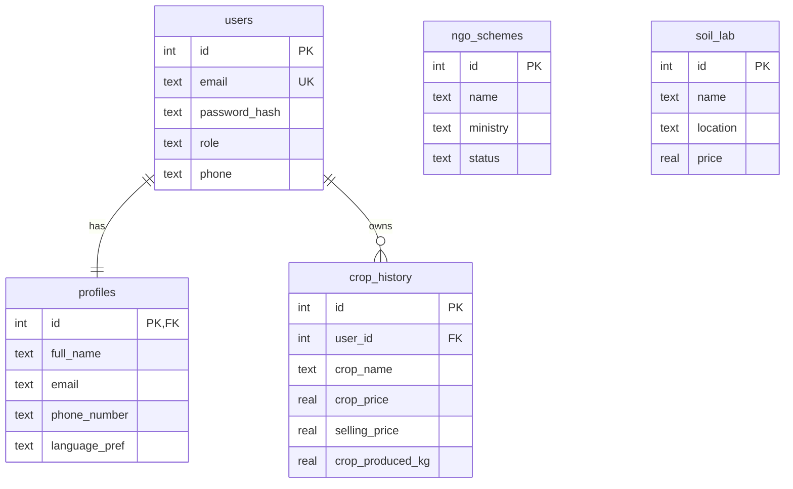
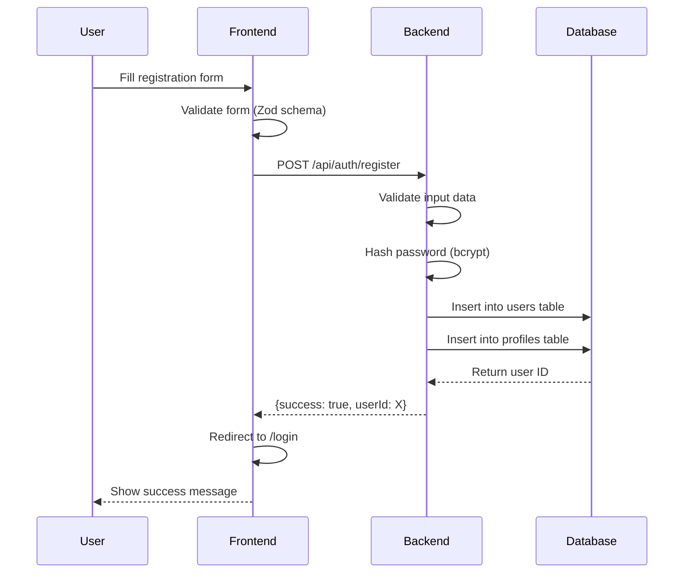
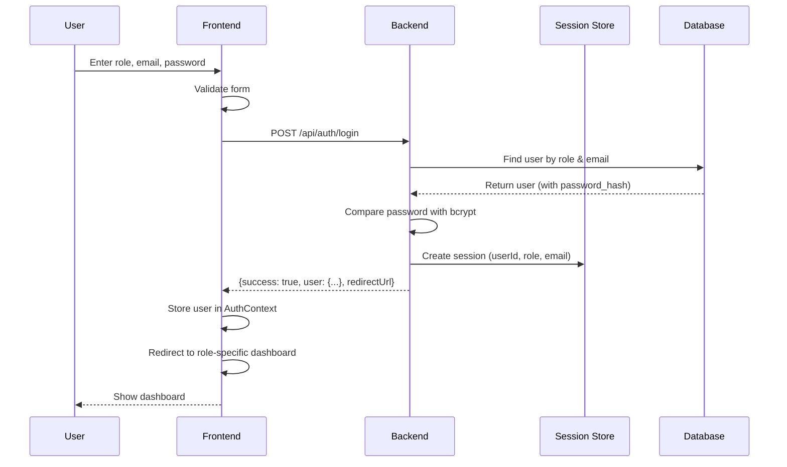
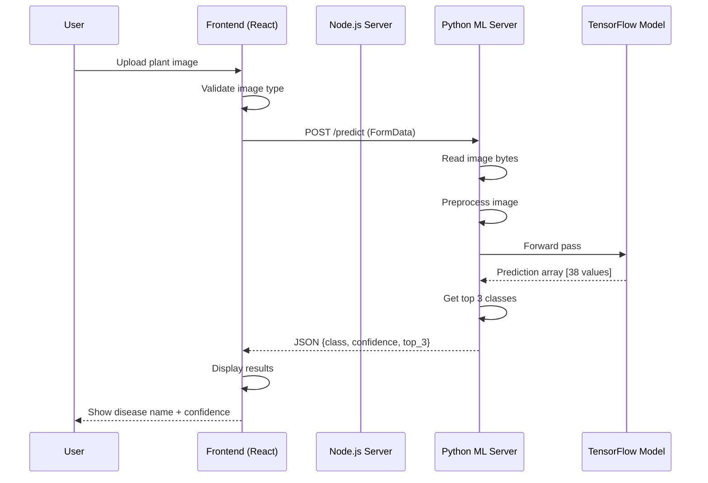
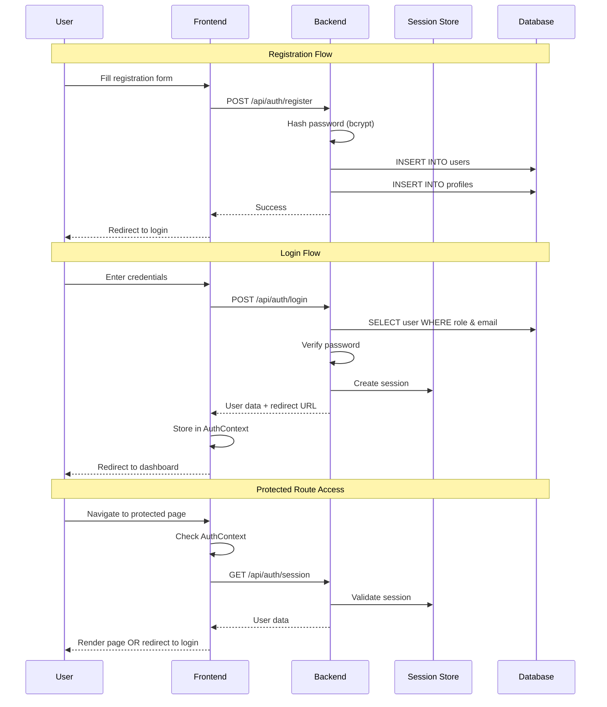
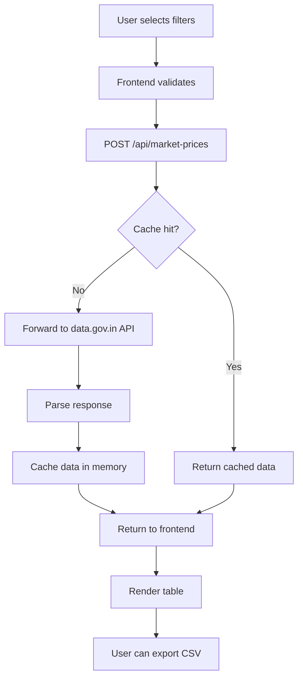

# FarmIQ - Complete Project Documentation

> **Purpose**: This document provides a comprehensive explanation of the FarmIQ agricultural technology platform. It covers the complete architecture, tech stack, features, workflows, and implementation details. This document is designed to enable any AI or developer to understand the entire project structure and functionality.

---

## Table of Contents

1. [Project Overview](#project-overview)
2. [System Architecture](#system-architecture)
3. [Technology Stack](#technology-stack)
4. [Database Schema](#database-schema)
5. [Authentication & Authorization](#authentication--authorization)
6. [Core Features](#core-features)
7. [API Endpoints](#api-endpoints)
8. [Frontend Architecture](#frontend-architecture)
9. [Backend Architecture](#backend-architecture)
10. [ML Inference System](#ml-inference-system)
11. [Data Flow & Workflows](#data-flow--workflows)
12. [Deployment](#deployment)
13. [Development Setup](#development-setup)

---

## Project Overview

### What is FarmIQ?

FarmIQ is a comprehensive agricultural technology platform designed to help farmers, vendors, and administrators manage various farming-related activities. It provides AI-powered crop disease detection, weather forecasting, market price tracking, soil analysis, and IoT sensor integration.

### Key Objectives

- **AI-Powered Insights**: Crop disease detection using deep learning
- **Data-Driven Decisions**: Weather forecasts, market prices, soil analysis
- **Digitization**: Move from traditional farming to data-driven agriculture
- **Multi-Stakeholder**: Support farmers, vendors, and administrators
- **Accessibility**: Multi-language support (English, Hindi, Punjabi)

### Project Type

- **Full-Stack Web Application**
- **Production-Ready**: Includes authentication, database, API, and ML inference
- **Scalable Architecture**: Microservices-based design with separate servers

---

## System Architecture

### High-Level Architecture



### Three-Tier Architecture

1. **Presentation Tier** (Frontend)
   - React TypeScript application
   - Served by Vite development server
   - Static assets and UI components

2. **Application Tier** (Backend)
   - Node.js Express server for business logic
   - Python FastAPI server for ML inference
   - Session management and authentication

3. **Data Tier** (Database)
   - SQLite for relational data storage
   - File system for trained ML model storage

---

## Technology Stack

### Frontend Technologies

#### Core Framework
- **React** `18.3.1` - UI library for building component-based interfaces
- **TypeScript** `5.8.3` - Static typing for JavaScript
- **React DOM** `18.3.1` - React rendering for web

#### Build Tools
- **Vite** `5.4.19` - Fast build tool and development server
- **PostCSS** `8.5.6` - CSS processing and transformations
- **Autoprefixer** `10.4.21` - CSS vendor prefix automation

#### Router & State
- **React Router DOM** `6.30.1` - Client-side routing
- **TanStack React Query** `5.83.0` - Server state management, caching, and data fetching
- **React Context API** - Global state management (AuthContext)

#### UI Framework
- **Tailwind CSS** `3.4.17` - Utility-first CSS framework
- **shadcn/ui** - Component library built on Radix UI
- **Radix UI** - Headless, accessible component primitives (20+ components)
- **Lucide React** `0.462.0` - Icon library with 1000+ icons

#### Form Management
- **React Hook Form** `7.61.1` - Form state management
- **Zod** `3.25.76` - Schema validation and type safety
- **@hookform/resolvers** `3.10.0` - Validation resolvers

#### Visualization
- **Recharts** `2.15.4` - Charting and data visualization library

#### Utilities
- **date-fns** `3.6.0` - Date manipulation
- **clsx** `2.1.1` - Conditional className utility
- **tailwind-merge** `2.6.0` - Merge Tailwind classes intelligently

### Backend Technologies

#### Node.js Backend (Main API Server)
- **Node.js** - JavaScript runtime environment
- **Express** `4.18.2` - Web application framework
- **express-session** `1.17.3` - Session management middleware
- **CORS** `2.8.5` - Cross-Origin Resource Sharing
- **bcryptjs** `2.4.3` - Password hashing
- **SQLite3** `5.1.6` - Embedded relational database

#### Python Backend (ML Inference Server)
- **FastAPI** `0.115.0` - Modern Python web framework for APIs
- **Uvicorn** `0.32.0` - ASGI server for running FastAPI
- **python-multipart** `0.0.12` - Form and file upload handling

#### Machine Learning Stack
- **TensorFlow** `2.16.1` - Deep learning framework
- **Keras** - High-level neural networks API (included with TensorFlow)
- **NumPy** `1.26.4` - Numerical computing library
- **Pillow (PIL)** `10.4.0` - Image processing library

### Database
- **SQLite3** - Lightweight, file-based relational database
- **Database File**: `server/farmiQ.db`

### Development Tools
- **ESLint** `9.32.0` - JavaScript/TypeScript linting
- **TypeScript ESLint** `8.38.0` - TypeScript-specific linting rules
- **npm/package-lock.json** - Package management
- **Python venv** - Isolated Python environment

---

## Database Schema

### Tables Overview

The database consists of 5 main tables:

1. **users** - User authentication
2. **profiles** - Extended user information
3. **ngo_schemes** - Government schemes
4. **soil_lab** - Soil testing laboratories
5. **crop_history** - Farmer crop production records

### Table Schemas

#### users
```sql
CREATE TABLE users (
  id INTEGER PRIMARY KEY AUTOINCREMENT,
  email TEXT UNIQUE,
  password_hash TEXT NOT NULL,
  role TEXT DEFAULT 'farmer',
  phone TEXT,
  created_at TEXT DEFAULT (datetime('now')),
  updated_at TEXT DEFAULT (datetime('now'))
);

CREATE INDEX idx_users_email ON users (email);
```

**Purpose**: Stores user authentication credentials
**Fields**:
- `id`: Auto-incrementing primary key
- `email`: Unique email address for login
- `password_hash`: bcrypt hashed password (10 salt rounds)
- `role`: User role ('farmer', 'vendor', 'admin')
- `phone`: Contact phone number
- `created_at`, `updated_at`: Timestamp tracking

#### profiles
```sql
CREATE TABLE profiles (
  id INTEGER PRIMARY KEY,
  full_name TEXT,
  email TEXT,
  phone_number TEXT,
  language_pref TEXT DEFAULT 'en',
  created_at TEXT DEFAULT (datetime('now')),
  updated_at TEXT DEFAULT (datetime('now')),
  FOREIGN KEY (id) REFERENCES users(id)
);
```

**Purpose**: Extended user profile information
**Fields**:
- `id`: Foreign key to users table
- `full_name`: User's full name
- `email`: Email address (duplicate from users for convenience)
- `phone_number`: Contact number
- `language_pref`: Language preference ('en', 'hi', 'pa')

#### ngo_schemes
```sql
CREATE TABLE ngo_schemes (
  id INTEGER PRIMARY KEY AUTOINCREMENT,
  name TEXT NOT NULL,
  ministry TEXT,
  deadline TEXT,
  location TEXT,
  contact_number TEXT,
  no_of_docs_required INTEGER,
  status TEXT DEFAULT 'active',
  benefit_text TEXT,
  eligibility_text TEXT,
  created_at TEXT DEFAULT (datetime('now')),
  updated_at TEXT DEFAULT (datetime('now'))
);
```

**Purpose**: Government agricultural schemes information
**Access**: All users can view, only admins can create/update/delete

#### soil_lab
```sql
CREATE TABLE soil_lab (
  id INTEGER PRIMARY KEY AUTOINCREMENT,
  name TEXT NOT NULL,
  location TEXT,
  contact_number TEXT,
  price REAL,
  rating REAL,
  tag TEXT,
  created_at TEXT DEFAULT (datetime('now')),
  updated_at TEXT DEFAULT (datetime('now'))
);
```

**Purpose**: Soil testing laboratory information
**Access**: All users can view, only admins can create/update/delete

#### crop_history
```sql
CREATE TABLE crop_history (
  id INTEGER PRIMARY KEY AUTOINCREMENT,
  user_id INTEGER NOT NULL,
  crop_name TEXT NOT NULL,
  crop_price REAL,
  selling_price REAL,
  crop_produced_kg REAL,
  created_at TEXT DEFAULT (datetime('now')),
  updated_at TEXT DEFAULT (datetime('now')),
  FOREIGN KEY (user_id) REFERENCES users(id)
);
```

**Purpose**: Track farmer's crop production history
**Access**: Farmers see only their crops, admins see all crops

### Database Relationships



---

## Authentication & Authorization

### Authentication Flow

#### Registration Process



**Steps**:
1. User fills registration form with email, password, role
2. Frontend validates using Zod schema
3. Backend receives request, validates input
4. Password is hashed using bcrypt (10 salt rounds)
5. User created in `users` table
6. Profile created in `profiles` table
7. Success response sent to frontend
8. User redirected to login page

#### Login Process



**Steps**:
1. User selects role and enters credentials
2. Frontend validates form
3. Backend queries database for user with matching role and email
4. Password compared with stored hash using bcrypt
5. Session created with user data
6. User data sent to frontend (without password_hash)
7. Frontend stores user in React Context
8. User redirected to appropriate dashboard

### Session Management

- **Type**: Server-side sessions
- **Storage**: In-memory (not persistent across server restarts)
- **Cookie Configuration**:
  - `httpOnly: true` - Prevent JavaScript access
  - `secure: false` (development) - Set to true in production
  - `maxAge: 24 hours` - Session expiry
- **Session Data**:
  - `userId`: User's database ID
  - `role`: User's role (farmer/vendor/admin)
  - `email`: User's email

### Role-Based Access Control (RBAC)

#### Roles

1. **Farmer**
   - Dashboard: `/farmer/dashboard`
   - Features: Weather, soil analysis, crop disease detection, market prices, IoT sensors, crop history, yield prediction, NGO schemes, teaching resources, QR generation
   - API Access: Own crop history, all NGO schemes, soil labs

2. **Vendor**
   - Dashboard: `/vendor/dashboard`
   - Features: Limited (placeholder for future development)
   - API Access: Cannot access crop history

3. **Admin**
   - Dashboard: `/admin/dashboard`
   - Features: All farmer features + admin management
   - API Access: Full CRUD on NGO schemes, soil labs, all crop history

#### Route Protection

**Frontend Protection**:
```typescript
<ProtectedRoute requiredRole="farmer">
  <FarmIQ />
</ProtectedRoute>
```

**Backend Protection**:
```javascript
// Require authentication
const requireAuth = (req, res, next) => {
  if (req.session.userId) {
    next();
  } else {
    res.status(401).json({ message: 'Authentication required' });
  }
};

// Require specific role
const requireRole = (roles) => {
  return (req, res, next) => {
    if (req.session.userId && roles.includes(req.session.role)) {
      next();
    } else {
      res.status(403).json({ message: 'Insufficient permissions' });
    }
  };
};
```

### Security Features

1. **Password Security**
   - bcrypt hashing with 10 salt rounds
   - Passwords never stored in plain text
   - Minimum 6 characters required

2. **Session Security**
   - HttpOnly cookies (prevent XSS)
   - Secure flag in production (HTTPS only)
   - 24-hour expiry

3. **Input Validation**
   - Client-side: React Hook Form + Zod
   - Server-side: Manual validation
   - Email format validation
   - Phone number validation (10 digits)

4. **SQL Injection Protection**
   - Parameterized queries
   - No raw SQL input from users

5. **CORS Configuration**
   - Limited to frontend origin
   - Credentials enabled

---

## Core Features

### 1. Crop Disease Detection (AI-Powered)

**Description**: Upload a photo of a plant leaf to detect diseases using a trained Keras/TensorFlow deep learning model.

**Technology Stack**:
- **Model**: Keras/TensorFlow CNN
- **Model File**: `plant_disease_recog_model_pwp.keras` (213 MB)
- **Input Size**: 160x160 pixels (RGB)
- **Output**: 38 disease classes
- **Preprocessing**: EfficientNet preprocessing (ImageNet normalization)

**Supported Diseases** (38 classes):
- Apple: scab, black rot, cedar apple rust, healthy
- Corn: gray leaf spot, common rust, northern leaf blight, healthy
- Grape: black rot, esca, leaf blight, healthy
- Tomato: bacterial spot, early blight, late blight, leaf mold, septoria, spider mites, target spot, yellow leaf curl virus, mosaic virus, healthy
- And more...

**Workflow**:
1. User uploads plant leaf image
2. Image sent to Python FastAPI server
3. Image preprocessed (resize to 160x160, EfficientNet normalization)
4. Model predicts disease class with confidence score
5. Top 3 predictions returned with metadata
6. Result displayed to user with recommendations

**API Endpoint**: `POST http://localhost:8000/predict`

### 2. Weather Forecasting

**Description**: 7-day weather forecast with hourly data and farming advice.

**Features**:
- Current weather conditions
- 7-day forecast with high/low temperatures
- Hourly forecast for current day
- Weather alerts
- Farming advice based on weather conditions

**Technology**: Mock data (production would integrate OpenWeatherMap or similar API)

### 3. Market Prices

**Description**: Real-time agricultural commodity prices with filtering by crop, state, and district.

**Features**:
- Filter by crop type
- Filter by state and district
- Date range filtering
- Export to CSV
- Data caching (in-memory)
- Rate limiting

**Technology**: Proxy endpoint to data.gov.in API

**API Endpoint**: `GET /api/market-prices`

### 4. Soil Analysis

**Description**: Analyze soil health and get recommendations for soil testing laboratories.

**Features**:
- Soil nutrient analysis
- pH level recommendations
- Fertilizer recommendations
- Nearby soil testing labs with pricing
- Contact information for labs

**Database**: `soil_lab` table with CRUD operations

### 5. IoT Sensor Management

**Description**: Request IoT sensor installation for farm monitoring and view real-time sensor data.

**Features**:
- Installation request form
- Technician allocation (automatic)
- Appointment scheduling
- Real-time sensor readings (temperature, humidity, soil moisture, light level)
- Farm alerts
- 24-hour data visualization

**Technology**: Mock data (production would integrate with real IoT devices via MQTT/WebSocket)

**Sensor Metrics**:
- Temperature (°C)
- Humidity (%)
- Soil Moisture (%)
- Light Level (Low/Medium/High)

### 6. Crop History & Yield Tracking

**Description**: Farmers can track their crop production history and prices.

**Features**:
- Add crop records (name, price, selling price, quantity produced)
- View crop history
- Edit/delete own records
- Data visualization (charts)
- Profit/loss analysis

**Access Control**: 
- Farmers: Own crops only
- Admins: All crops
- Vendors: No access

### 7. NGO Schemes

**Description**: Government agricultural schemes and subsidies information.

**Features**:
- Browse all schemes
- Filter by ministry, location
- View scheme details (benefits, eligibility, documents required)
- Contact information
- Application deadlines

**Access Control**:
- All users: Read access
- Admins only: Create/Update/Delete

### 8. Yield Prediction

**Description**: Predict crop yield based on various factors.

**Technology**: Mock predictions (production would use ML model)

### 9. QR Code Generation

**Description**: Generate QR codes for farm products with product information.

**Technology**: Client-side QR code generation library

### 10. Teaching Resources

**Description**: Educational content and tutorials for farmers.

**Content**: Best practices, crop guides, pest management

### 11. Profile Management

**Description**: View and edit user profile information.

**Editable Fields**:
- Full name
- Phone number
- Language preference

**Read-only Fields**:
- Email
- Role

---

## API Endpoints

### Authentication Endpoints

#### POST /api/auth/register
**Description**: Register a new user  
**Request Body**:
```json
{
  "role": "farmer",
  "full_name": "John Doe",
  "email": "john@example.com",
  "phone": "1234567890",
  "password": "password123",
  "language_pref": "en"
}
```
**Response**:
```json
{
  "ok": true,
  "userId": 1
}
```

#### POST /api/auth/login
**Description**: Login user  
**Request Body**:
```json
{
  "role": "farmer",
  "email": "john@example.com",
  "password": "password123"
}
```
**Response**:
```json
{
  "success": true,
  "user": {
    "id": 1,
    "role": "farmer",
    "email": "john@example.com",
    "phone": "1234567890"
  },
  "redirectUrl": "/farmer/dashboard"
}
```

#### GET /api/auth/session
**Description**: Get current session  
**Response**:
```json
{
  "authenticated": true,
  "user": {
    "id": 1,
    "role": "farmer",
    "email": "john@example.com",
    "phone": "1234567890"
  }
}
```

#### POST /api/auth/logout
**Description**: Logout user  
**Response**:
```json
{
  "ok": true
}
```

#### GET /api/auth/user/:id
**Description**: Get user details by ID  
**Auth**: Required (user can only access their own data)  
**Response**:
```json
{
  "id": 1,
  "role": "farmer",
  "email": "john@example.com",
  "phone": "1234567890",
  "created_at": "2025-01-01T00:00:00.000Z"
}
```

### Profile Endpoints

#### GET /api/me/profile
**Description**: Get current user's profile  
**Auth**: Required

#### PUT /api/me/profile
**Description**: Update current user's profile  
**Auth**: Required  
**Request Body**:
```json
{
  "full_name": "John Doe",
  "phone_number": "1234567890",
  "language_pref": "en"
}
```

### NGO Schemes Endpoints

#### GET /api/ngo-schemes
**Description**: Get all NGO schemes  
**Auth**: Required

#### GET /api/ngo-schemes/:id
**Description**: Get NGO scheme by ID  
**Auth**: Required

#### POST /api/ngo-schemes
**Description**: Create NGO scheme  
**Auth**: Admin only

#### PUT /api/ngo-schemes/:id
**Description**: Update NGO scheme  
**Auth**: Admin only

#### DELETE /api/ngo-schemes/:id
**Description**: Delete NGO scheme  
**Auth**: Admin only

### Soil Lab Endpoints

#### GET /api/soil-labs
**Description**: Get all soil labs  
**Auth**: Required

#### GET /api/soil-labs/:id
**Description**: Get soil lab by ID  
**Auth**: Required

#### POST /api/soil-labs
**Description**: Create soil lab  
**Auth**: Admin only

#### PUT /api/soil-labs/:id
**Description**: Update soil lab  
**Auth**: Admin only

#### DELETE /api/soil-labs/:id
**Description**: Delete soil lab  
**Auth**: Admin only

### Crop History Endpoints

#### GET /api/crops
**Description**: Get crops (farmers get own, admins get all)  
**Auth**: Required (vendors denied)

#### POST /api/crops
**Description**: Create crop record  
**Auth**: Farmers and admins only  
**Request Body**:
```json
{
  "crop_name": "Wheat",
  "crop_price": 2000,
  "selling_price": 2500,
  "crop_produced_kg": 1000
}
```

#### PUT /api/crops/:id
**Description**: Update crop record  
**Auth**: Owner or admin only

#### DELETE /api/crops/:id
**Description**: Delete crop record  
**Auth**: Owner or admin only

### IoT Sensor Endpoints

#### GET /api/iot/status
**Description**: Get installation request status

#### POST /api/iot/request
**Description**: Create installation request  
**Request Body**:
```json
{
  "farmerName": "John Doe",
  "phone": "1234567890",
  "preferredDate": "2025-01-15",
  "preferredWindow": "morning"
}
```

#### POST /api/iot/reschedule
**Description**: Reschedule appointment

#### POST /api/iot/cancel
**Description**: Cancel request

#### GET /api/iot/readings
**Description**: Get sensor readings  
**Query Params**: `?since=2025-01-01T00:00:00.000Z`

#### GET /api/iot/alerts
**Description**: Get farm alerts

### ML Inference Endpoints

#### POST http://localhost:8000/predict
**Description**: Predict crop disease from image  
**Request**: multipart/form-data with `file` field  
**Response**:
```json
{
  "class_name": "Tomato___Late_blight",
  "confidence": 0.87,
  "top_3": [
    {"class": "Tomato___Late_blight", "confidence": 0.87},
    {"class": "Tomato___Early_blight", "confidence": 0.08},
    {"class": "Tomato___healthy", "confidence": 0.03}
  ],
  "metadata": {
    "request_id": "REQ_1234567890",
    "timestamp": 1234567890,
    "processing_time_ms": 125.45,
    "prediction_time_ms": 85.23
  }
}
```

#### GET http://localhost:8000/health
**Description**: Health check for ML server  
**Response**:
```json
{
  "status": "healthy",
  "model_loaded": true,
  "model_path": "/path/to/model.keras",
  "model_input_shape": "(None, 160, 160, 3)",
  "model_output_shape": "(None, 38)",
  "num_classes": 38
}
```

---

## Frontend Architecture

### Project Structure

```
src/
├── components/
│   ├── ui/                 # shadcn/ui components (Button, Input, Dialog, etc.)
│   ├── farmiq/            # FarmIQ-specific components
│   ├── weather/           # Weather components
│   ├── iot/               # IoT sensor components
│   ├── market/            # Market price components
│   ├── ChatbotWidget.tsx  # Chatbot component
│   ├── ErrorBoundary.tsx  # Error handling
│   └── ProtectedRoute.tsx # Route protection
├── pages/
│   ├── Login.tsx          # Login page
│   ├── Register.tsx       # Registration page
│   ├── FarmIQ.tsx         # Farmer dashboard
│   ├── VendorDashboard.tsx
│   ├── AdminDashboard.tsx
│   ├── CropDiseaseDetection.tsx
│   ├── Weather.tsx
│   ├── MarketPrices.tsx
│   ├── IoTSensor.tsx
│   ├── SoilAnalysis.tsx
│   ├── YieldPrediction.tsx
│   ├── NGOSchemes.tsx
│   ├── Teaching.tsx
│   ├── QRGeneration.tsx
│   └── Profile.tsx
├── services/
│   ├── authService.ts     # Authentication API calls
│   ├── predictionService.ts # ML prediction API calls
│   ├── weatherService.ts  # Weather API calls
│   ├── marketPricesService.ts # Market API calls
│   ├── iotService.ts      # IoT API calls
│   └── api.ts             # Base API configuration
├── contexts/
│   └── AuthContext.tsx    # Authentication context
├── hooks/
│   ├── use-toast.ts       # Toast notification hook
│   └── useLanguage.ts     # Language switching hook
├── lib/
│   ├── utils.ts           # Utility functions
│   ├── googleTranslate.ts # Translation integration
│   └── translations.ts    # Translation strings
├── types/
│   └── weather.ts         # TypeScript type definitions
└── utils/
    ├── predictionUtils.ts # Prediction helpers
    └── mockTTSApi.ts      # Mock TTS API
```

### Key Frontend Patterns

#### 1. Service Layer Pattern
All API calls are abstracted into service files:
```typescript
// authService.ts
export const authService = {
  login: async (role, email, password) => {
    const response = await fetch(`${API_BASE_URL}/auth/login`, {
      method: 'POST',
      headers: { 'Content-Type': 'application/json' },
      credentials: 'include',
      body: JSON.stringify({ role, email, password })
    });
    return response.json();
  }
};
```

#### 2. Context Pattern for Global State
```typescript
// AuthContext.tsx
export const AuthProvider = ({ children }) => {
  const [user, setUser] = useState(null);
  const [isAuthenticated, setIsAuthenticated] = useState(false);
  
  // Check session on mount
  useEffect(() => {
    checkSession();
  }, []);
  
  return (
    <AuthContext.Provider value={{ user, isAuthenticated, login, logout }}>
      {children}
    </AuthContext.Provider>
  );
};
```

#### 3. Protected Routes
```typescript
export const ProtectedRoute = ({ children, requiredRole }) => {
  const { isAuthenticated, user } = useAuth();
  
  if (!isAuthenticated) {
    return <Navigate to="/login" />;
  }
  
  if (requiredRole && user.role !== requiredRole) {
    return <Navigate to={`/${user.role}/dashboard`} />;
  }
  
  return children;
};
```

#### 4. Form Validation with Zod
```typescript
const loginSchema = z.object({
  role: z.enum(['farmer', 'vendor', 'admin']),
  email: z.string().email('Invalid email'),
  password: z.string().min(6, 'Password must be at least 6 characters')
});

const { register, handleSubmit, formState: { errors } } = useForm({
  resolver: zodResolver(loginSchema)
});
```

---

## Backend Architecture

### Node.js/Express Server Structure

```
server/
├── server.js          # Main Express server
├── auth.js            # Authentication helpers
├── database.js        # Database helpers
├── farmiQ.db          # SQLite database file
├── migrations/        # Database migrations
│   ├── 001_create_ngo_soil_tables.sql
│   ├── 02_create_profiles_table.sql
│   └── 005_create_crop_history.sql
├── package.json       # Dependencies
└── Procfile          # Deployment configuration
```

### Key Backend Patterns

#### 1. Middleware Pattern
```javascript
// Authentication middleware
const requireAuth = (req, res, next) => {
  if (req.session.userId) {
    next();
  } else {
    res.status(401).json({ message: 'Authentication required' });
  }
};

// Role-based middleware
const requireRole = (roles) => {
  return (req, res, next) => {
    if (req.session.userId && roles.includes(req.session.role)) {
      next();
    } else {
      res.status(403).json({ message: 'Insufficient permissions' });
    }
  };
};
```

#### 2. Database Helper Pattern
```javascript
const dbHelpers = {
  findUserByRoleAndEmail: (role, email) => {
    return new Promise((resolve, reject) => {
      db.get(
        `SELECT * FROM users WHERE role = ? AND email = ?`,
        [role, email],
        (err, row) => {
          if (err) reject(err);
          else resolve(row);
        }
      );
    });
  }
};
```

#### 3. Error Handling
```javascript
// Global error handler
app.use((err, req, res, next) => {
  console.error('Server error:', err);
  res.status(500).json({ message: 'Internal server error' });
});

// 404 handler
app.use('*', (req, res) => {
  res.status(404).json({ message: 'Route not found' });
});
```

---

## ML Inference System

### Model Information

- **Model Type**: Convolutional Neural Network (CNN)
- **Framework**: Keras/TensorFlow
- **Architecture**: Based on EfficientNet
- **Model File**: `plant_disease_recog_model_pwp.keras` (213 MB)
- **Input**: 160x160x3 RGB images
- **Output**: 38-class softmax probability distribution
- **Training Dataset**: PlantVillage dataset

### Inference Pipeline


### Preprocessing Steps

1. **Image Loading**: Read uploaded file bytes
2. **PIL Opening**: Open image with Pillow
3. **RGB Conversion**: Convert to RGB mode (if needed)
4. **Resizing**: Resize to 160x160 using LANCZOS resampling
5. **NumPy Conversion**: Convert to uint8 NumPy array
6. **EfficientNet Preprocessing**: 
   - Apply ImageNet normalization
   - Range: [-1, 1] (not [0, 1])
7. **Batch Dimension**: Add dimension for batch processing
8. **Prediction**: Forward pass through model
9. **Post-processing**: Get top classes with confidence scores

### Python Server Configuration

- **Framework**: FastAPI
- **Server**: Uvicorn ASGI server
- **Port**: 8000
- **CORS**: Enabled for all origins (development)
- **Logging**: INFO level with detailed request/response logging

---

## Data Flow & Workflows

### Complete Crop Disease Detection Workflow



### User Authentication Workflow



### Market Prices Data Flow



---

## Deployment

### Local Development Setup

#### Prerequisites
- Node.js 16+ and npm
- Python 3.9+
- Git

#### Steps

1. **Clone Repository**
```bash
git clone <repository-url>
cd FarmIQ-functional-main
```

2. **Install Frontend Dependencies**
```bash
npm install
```

3. **Install Backend Dependencies**
```bash
cd server
npm install
cd ..
```

4. **Setup Python Environment**
```bash
# Windows
python -m venv venv
venv\Scripts\activate

# Linux/Mac
python -m venv venv
source venv/bin/activate

pip install -r requirements.txt
```

5. **Configure Environment Variables**
```bash
cp env.example .env
```

Edit `.env`:
```
VITE_API_URL=http://localhost:3001/api
VITE_PREDICTION_API_URL=http://localhost:8000
```

6. **Start Services**

Terminal 1 - Python ML Server:
```bash
uvicorn inference_server:app --host 0.0.0.0 --port 8000 --reload
```

Terminal 2 - Node.js Backend:
```bash
cd server
node server.js
```

Terminal 3 - Frontend:
```bash
npm run dev
```

7. **Access Application**
- Frontend: http://localhost:5173
- Backend API: http://localhost:3001
- ML Server: http://localhost:8000

### Production Deployment

#### Build Frontend
```bash
npm run build
# Output: dist/ directory
```

#### Deploy Backend (Node.js)
- Use PM2 or similar process manager
- Set `NODE_ENV=production`
- Configure HTTPS (set `secure: true` for cookies)
- Use PostgreSQL/MySQL instead of SQLite for better concurrency

#### Deploy ML Server (Python)
```bash
# Use Gunicorn with Uvicorn workers
gunicorn inference_server:app -w 4 -k uvicorn.workers.UvicornWorker --bind 0.0.0.0:8000
```

#### Environment Considerations
- Minimum 2GB RAM for ML server (model is ~213MB)
- Consider model quantization for production
- Use Redis for session storage
- Enable CORS only for production frontend domain
- Use environment variables for API keys

---

## Development Setup

### Starting the Project

```bash
# 1. Start Python ML server (Terminal 1)
cd FarmIQ-functional-main
source venv/bin/activate  # or venv\Scripts\activate on Windows
uvicorn inference_server:app --host 0.0.0.0 --port 8000 --reload

# 2. Start Node.js backend (Terminal 2)
cd server
node server.js

# 3. Start React frontend (Terminal 3)
npm run dev
```

### Testing

#### Test ML Server
```bash
curl -F "file=@sample_leaf.jpg" http://localhost:8000/predict
```

#### Test Backend
```bash
curl http://localhost:3001/api/health
```

#### Test Authentication
```powershell
# See test-auth.ps1 for complete authentication flow tests
```

---

## Summary

FarmIQ is a **full-stack agricultural technology platform** with:

- **3-tier architecture**: React frontend, Node.js backend, Python ML server
- **Multi-role authentication**: Farmers, vendors, admins with role-based access
- **AI-powered features**: Crop disease detection using TensorFlow/Keras
- **Data management**: SQLite database with 5 tables (users, profiles, ngo_schemes, soil_lab, crop_history)
- **RESTful APIs**: 30+ endpoints for authentication, CRUD operations, and ML inference
- **Production-ready**: Session management, password hashing, input validation, error handling
- **Scalable**: Microservices architecture with separate servers for different concerns

**Key Technologies**:
- Frontend: React 18, TypeScript, Tailwind CSS, shadcn/ui, React Query
- Backend: Node.js, Express, SQLite, bcrypt, session management
- ML Server: Python, FastAPI, TensorFlow, Keras, Pillow, NumPy
- Model: 38-class plant disease classifier (213 MB)

This documentation provides complete details for understanding, developing, and deploying the FarmIQ platform.
